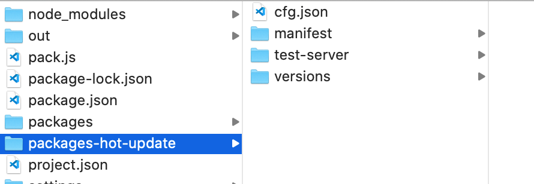
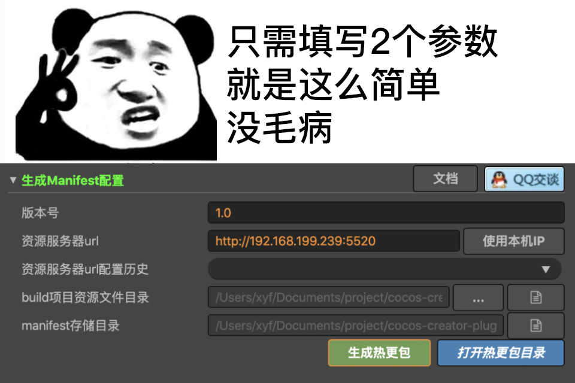
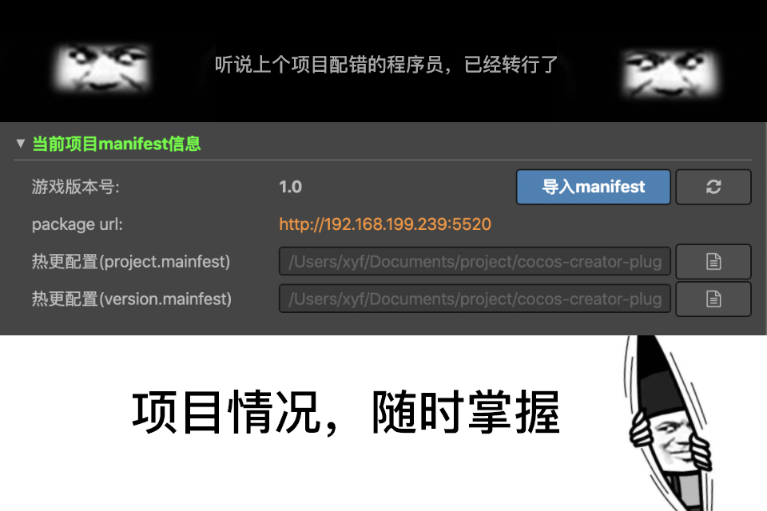
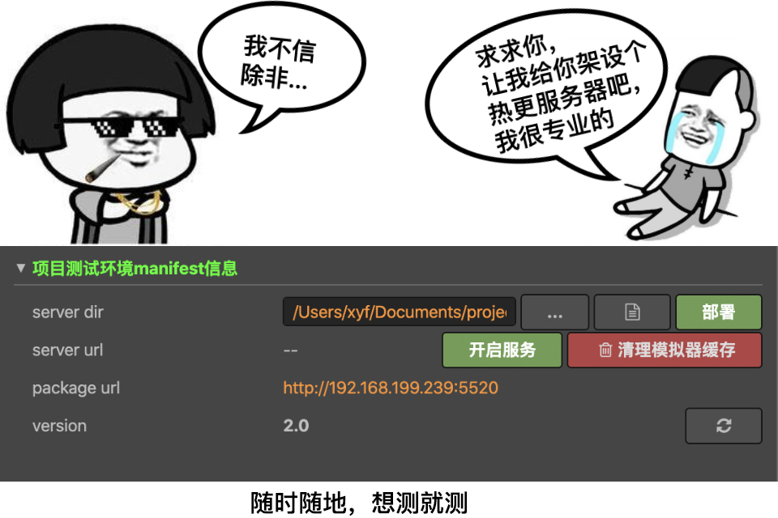

# hot-update-tools
## 工具说明
本工具仅仅是对官方的热更新方案的一个可视化解决方案

可以帮助你快速生成`project.manifest`和`version.manifest`文件,并且提供了本地测试的一些常用操作

使用前请移步[官方热更新教程](https://github.com/cocos-creator/tutorial-hot-update)

## 热更新例子
- 等待更新。。。

## 使用说明
- 使用该工具前,必须执行 **项目=>构建** （重要事情说三遍）
- 使用该工具前,必须执行 **项目=>构建** （重要事情说三遍）
- 使用该工具前,必须执行 **项目=>构建** （重要事情说三遍）
- 菜单位置: 项目 => 热更新工具(Ctrl+u)
- 在发布平台安装包的时候,建议当前的manifest配置和当前项目的资源是吻合的,否则,可能会造成更新后的未知问题

## 关于插件配置目录

插件在启动后，会进行初始化工作，会在当前项目生成以下配置，保证不同的项目之间不会相互干扰
 
 -  project/package-hot-update/ 为配置的根目录
     - cfg.json 保存插件的配置
     - manifest 点击`生成热更包`后，生成的临时manifest文件保存目录
     - version 点击`生成热更包`后，会将manifest和resources一起打包为ver_xxx.zip，并存放到该目录
     - test-server 默认的静态文件服务目录，点击`部署`会将生成的manifest和resources拷贝到该目录
          
 
## 界面一共包含4部分
### 第1部分:生成Manifest配置

在这部分你可以看到有2个需要你填写的参数:
- 版本号:
    - 游戏热更新版本号,这个版本号建议是x.x.x.x的格式,例如1.2.0.1
- 资源服务器url:  
    - 游戏热更新资源的服务器url,即客户端发起热更新http请求的url
    - 例如你的服务器地址为100.200.300.400,那么这里你需要填写 http://100.200.300.400 插件会自动帮你默认追加http，https的需要自己手动调整下
    - 如果你有目录层级,比如我放在了gameUpdate目录下,那么这里你就需要填写 http://100.200.300.400/gameUpdate
    - 也就是说你最终填写的这个url+"project.manifest",能够在浏览器中正确访问,那么这个url就是有效的,不懂得请仔细查阅官方热更新文档

同是你看到有2个参数是不可编辑的
- build项目资源文件目录
     - 如果你执行过 项目=>构建 的话,那么在插件启动时,该目录就会默认指向build/jsb-default,如果该目录下的src,res就是热更新要的文件,如果插件启动后,该参数为空,日志会提示需要你构建一下项目

- manifest存储目录
    - 该参数会在插件启动时默认初始化,指向的目录就是最终热更新生成的manifest文件存放处
    - 默认位置为`project/package-hot-update/`,该参数对于开发者是透明,避免参数过多,造成使用上的困惑

完成以上配置后，**确保你已经构建过项目后**，点击`生成热更包`即可。

### 第2部分:当前项目Manifest信息

开发这个功能原因:
- **经常看到其他人在填写版本号的时候,填写的很随意,不知道当前游戏版本号是多少,很容易填写的版本号比当前运行游戏的版本号要低,然后反馈给我说游戏热更新不能用**

如果你的界面如上图所示，说明你的项目中没有manifest文件，你需要进行以下操作
- 构建你的项目
- 在第一部分，配置好Manifest相关配置，点击`生成热更包`，生成manifest文件
- 点击`导入`按钮，将刚刚生成的manifest文件导入到项目中，为了避免使用困惑，默认导入位置为`项目根目录/assets/`
- 如果你对这个默认位置不满意，可以在项目中手动调整manifest文件的位置，再重新打开下插件即可

当项目中存在manifest后，如上图所示，在这个界面里可以方便的查看当前项目里面的版本信息
- package url
- 游戏版本号
- 项目中使用的manifest位置

需要注意的是
- 如果你需要更新项目的manifest文件，你需要
    - 重新构建下项目，生成最新的resources
    - 点击`生成热更包`重新生成最新的manifest
    - 点击`导入manifest`即可
    
- **如果项目中的manifest文件发生变动,该插件不会主动刷新,需要手动点击刷新按钮**

### 第3部分:测试环境Manifest文件信息(方便进行本地热更测试)

当在`packages-hot-update/versions`顺利生成热更包后,你可能需要进行一下本机的一个简单测试,那么这个功能就是为此开发的
- server dir 默认指向`packages-hot-update/test-server`，
    - 当然你可以进行修改，但是请务必确保自定义目录包含有效的热更文件
- 部署：将生成的manifest和resources拷贝到`server dir`
- 开启服务： 创建一个Express服务，用来支持测试热更
    - 请务必确保你的`package url`和`server url` 一定要一致，否则可能无法正常工作
- 清理模拟器缓存： 
    - 该操作会删除creator自带模拟器的热更新缓存
    - 清理后，不需要反复更新版本号就可以反复测试热更新功能
    - windows: creator\resources\cocos2d-x\simulator\win32\remote-asset
    - mac: CocosCreator.app/Contents/Resources/cocos2d-x/simulator/mac/Simulator.app/Contents/Resources/remote-asset
 

### 第4部分: 日志
这里显示了一些插件的操作提示,如果使用过程中出现问题,请耐心阅读提示,也许能够得到帮助
#### 最后
工具仅仅是原理的一个友好帮助,在使用的过程中,还是希望使用者能够对官方的热更新文档进行仔细的阅读,这样才能更加透彻的理解和使用该工具.

## 如何导出热更新资源
`packages-hot-update/versions`目录会根据配置自动生成热更包

## 导出的热更新资源如何使用
放到你填写的`packageUrl`服务器上边即可

## 插件能否支持lua?
好多小伙伴问我这个问题,其实这个插件仅仅是对项目资源进行了一次md5,并没有引入热更新的逻辑代码,所以这个插件应该是适合所有游戏热更新方案的,因为热更新原理其实就是比对本地和远程的资源是否一致,不一致进行一次同步

## 关于
- 该工具是自己游戏开发生涯中的一个小积累
- 如果你喜欢,请告诉你的小伙伴,
- 如果不喜欢,请告诉我哪里不好(QQ群**224756137**),帮助我完善它

 
 
