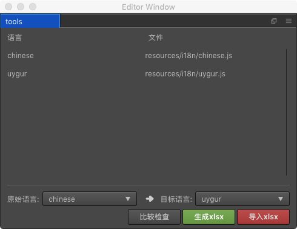

# 工具使用教程
在阅读使用教程前,建议详细阅读下[工作流程](tool.md)

通过菜单`扩展->i18n->tools`打开工具面板

### 使用步骤
- 使用前,必须指定必要的参数
    - 原始语言: 这个将会作为生成Excel的数据来源依据
    - 目标语言: 待翻译的语言

- 点击`生成Excel` 就可以生成Excel供翻译人员进行填写
    - 注意:生成规则是,如果目标语言对应的key有值,会自动填写到Excel中,所以这样就很方便迭代翻译
- `导入Excel`,将翻译人员填写好的Excel导入到工具,工具会自动序列化一份`{目标语言}.js`,同时会提示导入    
   
- 点击 `确定` ,导入到项目,即可完成翻译文件的制作

### 比较检查   
当原始翻译内容发生了变化,增加变动了翻译内容,那么我需要通知翻译人员进行迭代翻译,那么`比较检查`会给出提示

提示类型大致分3种:
- 丢失的key

| - | 原始语言 | 目标语言 |
| :------: | :------: | :------: |
| key |  ✔ |✘ | 
      
- 多余的key

| - | 原始语言 | 目标语言 |
| :------: | :------: | :------: |
| key | ✘ | ✔ | 

- 空字符串key

| - | 原始语言 | 目标语言 |
| :------: | :------: | :------: |
| key | 空字符串("") | * | 

