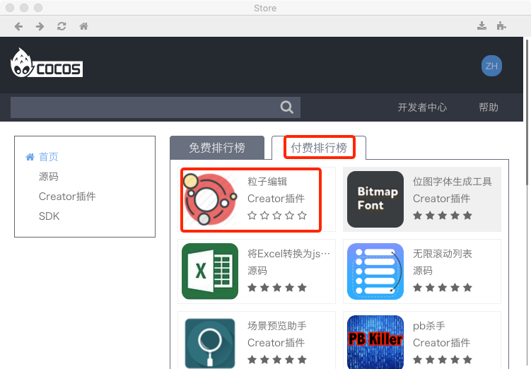
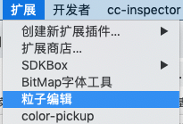
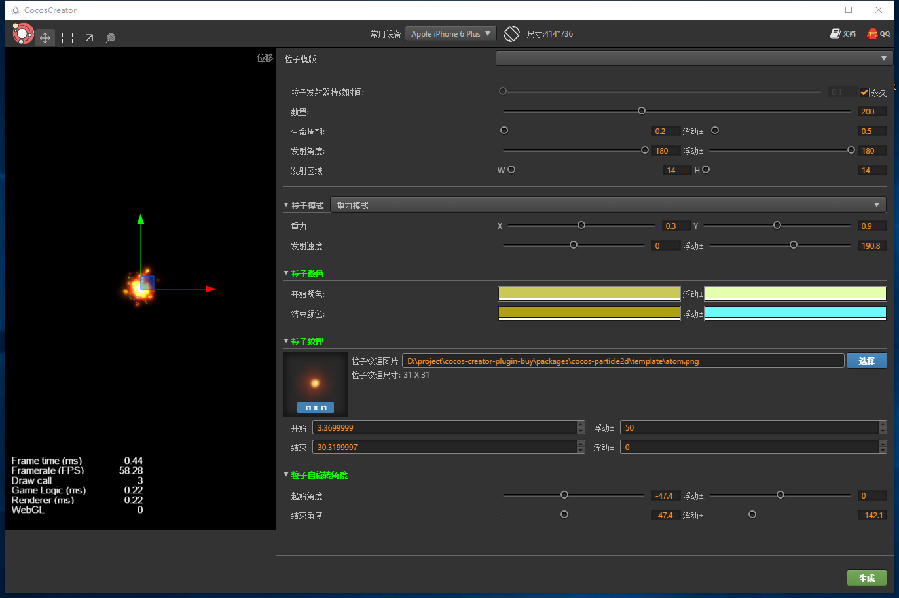
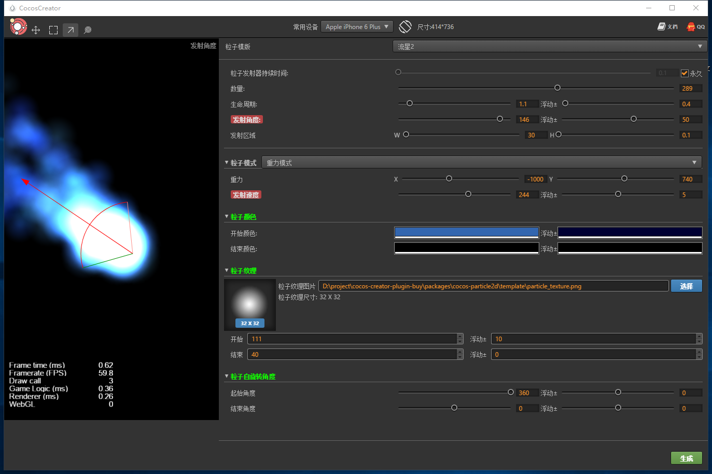
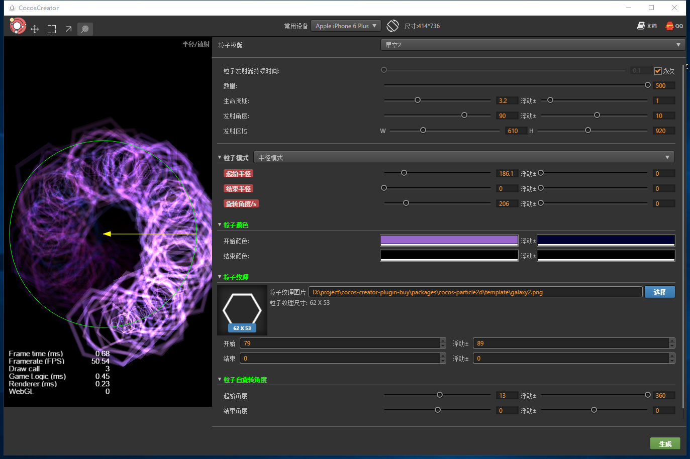
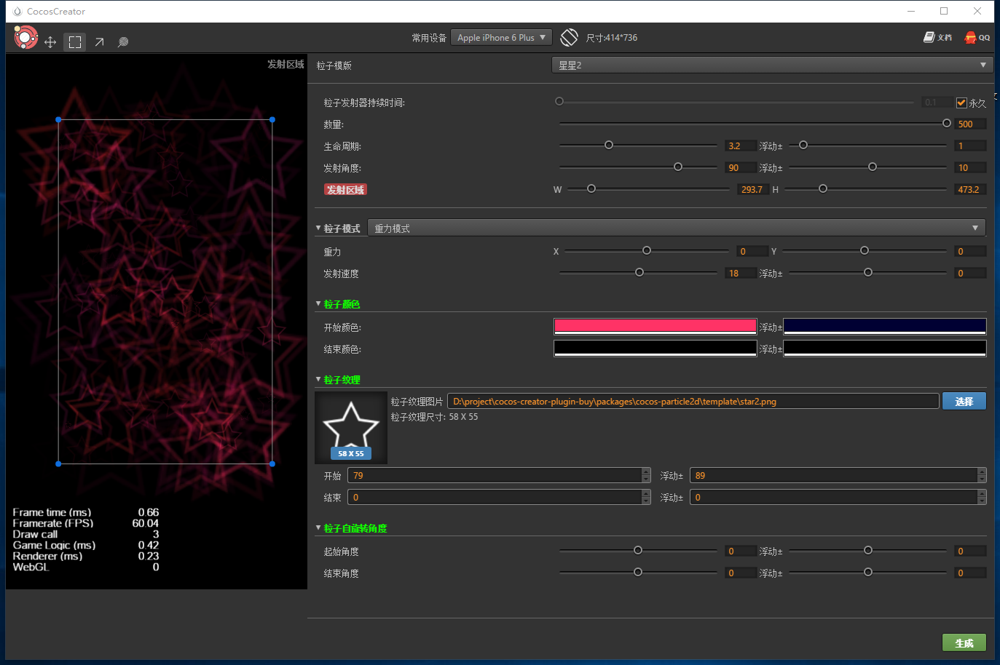

# 粒子编辑插件

一款编辑粒子的插件,和市面上的粒子编辑器区别不大,里面加入了作者自己对参数的一些理解，完全汉化界面、参数图形可视化调整，更方便非程序人员使用,快速调整出来自己想要的粒子效果

## 安装下载
如何安装下载安装插件,请看[文档](../commonSense/index.md)

插件下载地址： http://store.cocos.com/stuff/show/178996.html

## 视频教程
[哔哩哔哩](https://www.bilibili.com/video/av43854514/)
详细介绍插件的具体使用细节

## 如何打开插件

## 使用说明
- 部分粒子参数进行了可视化图形操作
- 内置了大量粒子模版,可在模版的基础上快速调整出来粒子效果
- 粒子纹理支持直接拖拽
- 生成的粒子文件*.plist,*.plist文件名以纹理图片文件名为准
    - 比如你的纹理图片叫做star.png,那么最终的粒子文件为sun.plist, sun.png
- 更多建议,请QQ联系作者,谢谢支持    

## 常见问题
1. 如何控制颜色？
首先来看一下参数的含义 
- starColor: 原始颜色
- starColorVar：浮动值
- endColor:结束颜色
- endColorVar:浮动值

计算方式为：  
开始叠加色 = 原始颜色 ± 浮动值/2
结束叠加色 = 结束颜色 ± 浮动值/2

图片真正的颜色 = 图片原来的颜色 * 叠加色

举个例子： 
有一张白色的图片：rgba(255, 255, 255, 255)
- startColor=rgba(255, 255, 255, 255)

## 插件截图

